# Tài liệu Kiến trúc: Batch Management API

> Module: `batch-scheduler` — Hệ thống quản lý và điều phối tác vụ Batch (chạy ngầm theo lịch)

---

## 1. Giới thiệu chung

Module **batch-scheduler** cung cấp hai lớp API chính:

| Controller | Vai trò | Ví von (cho BA) |
|---|---|---|
| **BatchConfigController** | Quản lý danh mục tác vụ gốc (Job Registry) | **"Kho vật tư"** — định nghĩa sẵn từng tác vụ đơn lẻ |
| **BatchFlowController** | Quản lý luồng thực thi (Flow Orchestration) | **"Dây chuyền sản xuất"** — lắp ráp các tác vụ thành quy trình có thứ tự |

> [!IMPORTANT]
> Mô hình kiến trúc hiện tại là **Flow-first Orchestration**: Flow là đơn vị lên lịch và thực thi duy nhất. Config chỉ là bản mô tả tác vụ, không tự chạy.

---

## 2. Chi tiết các Endpoints (Điểm cuối API)

### 2.1. BatchConfigController — `/api/v1/batch/management/configs`

Quản lý CRUD cho **cấu hình Job gốc** (Job Registry). Mỗi cấu hình là bản mô tả của một tác vụ batch (ví dụ: "Tính điểm khách hàng", "Xuất báo cáo doanh thu").

| HTTP Method | Endpoint | Tham số | Chức năng |
|---|---|---|---|
| `GET` | `/` | `status`, `jobGroup`, `jobType`, `search`, `pageable` | Danh sách cấu hình (phân trang + tìm kiếm) |
| `GET` | `/{id}` | `id` (Long) | Chi tiết một cấu hình |
| `POST` | `/` | `BatchConfigCreateRequest` | Tạo mới cấu hình |
| `PUT` | `/{id}` | `id`, `BatchConfigUpdateRequest` | Cập nhật cấu hình |
| `PATCH` | `/{id}/status` | `id`, `status` (LifecycleStatus) | Đổi trạng thái nhanh (ACTIVE/DISABLED) |
| `DELETE` | `/{id}` | `id` | Xóa cấu hình |

### 2.2. BatchFlowController — `/api/v1/batch/management/flows`

Quản lý CRUD cho **luồng chạy** (Flow). Đây là API hợp nhất (Unified API) — mỗi request tạo/cập nhật Flow sẽ bao gồm luôn cả Schedule, SLA, Steps, và Notifications trong **một giao dịch nguyên tử** (Atomic Transaction).

| HTTP Method | Endpoint | Tham số | Chức năng |
|---|---|---|---|
| `GET` | `/` | `status`, `pageable` | Danh sách luồng chạy |
| `GET` | `/{flowId}` | `flowId` (Long) | Chi tiết đầy đủ (Flow + Steps + Schedule + SLA + Notifications) |
| `POST` | `/` | `FlowCreateRequest` | Tạo luồng hợp nhất |
| `PUT` | `/{flowId}` | `flowId`, `FlowUpdateRequest` | Cập nhật luồng (Smart Merge cho Steps) |
| `DELETE` | `/{flowId}` | `flowId` | Xóa toàn bộ luồng |

---

## 3. Sơ đồ Kiến trúc Tổng quan

Minh họa cách Client giao tiếp với hai Controller và các Service Layer phía dưới:

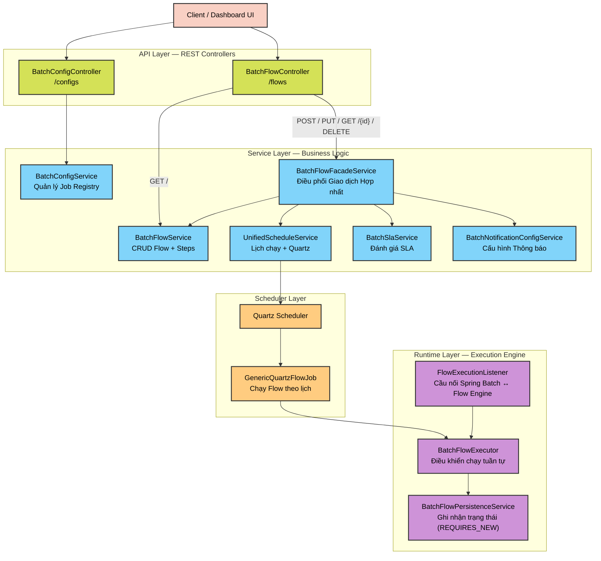

---

## 4. ⭐ Luồng Chạy Runtime — Flow Execution (Chi tiết)

Đây là phần mô tả **cách một Flow thực sự chạy các Job** từ khi được kích hoạt đến khi hoàn thành hoặc thất bại.

### 4.1. Sequence Diagram — Luồng Chạy Tuần Tự Thành Công

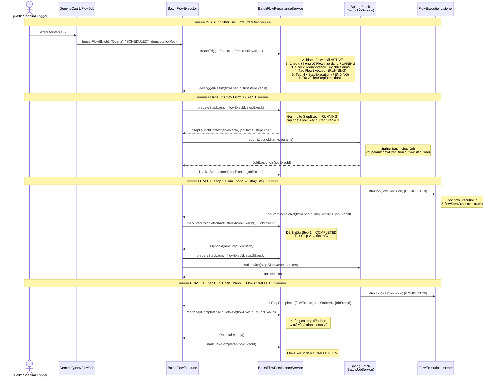

### 4.2. Sequence Diagram — Fail-Fast (Bước Thất Bại → Dừng Flow)

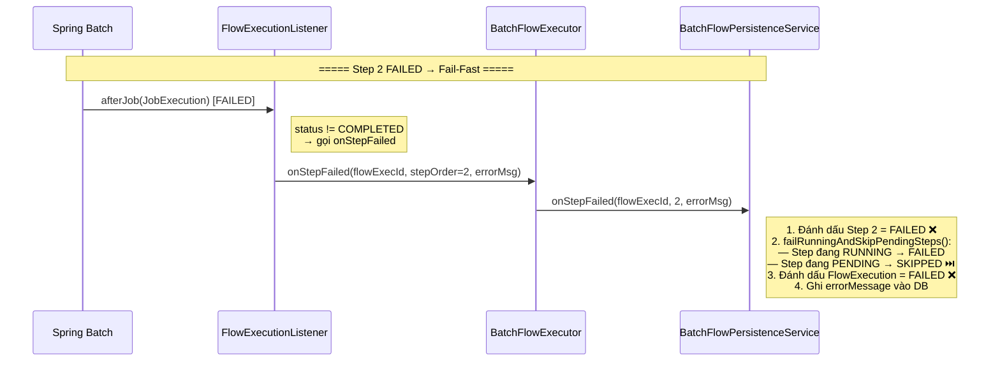

> [!WARNING]
> **Fail-Fast Policy**: Khi bất kỳ step nào thất bại, toàn bộ các step còn lại sẽ bị đánh dấu **SKIPPED** và Flow sẽ chuyển sang trạng thái **FAILED**. Hệ thống **KHÔNG** retry (chạy lại) tự động — đây là quyết định thiết kế có chủ đích.

### 4.3. Sequence Diagram — User Stop (Dừng Thủ Công)

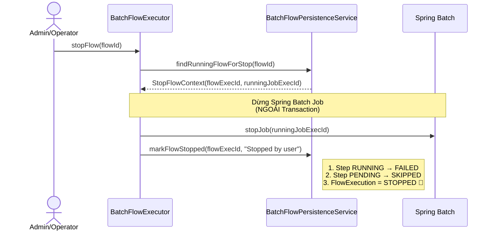

---

## 5. Vòng đời Trạng thái (State Machine)

### 5.1. Flow Definition Lifecycle — Vòng đời Cấu hình Flow

Trạng thái quản lý của **bản định nghĩa Flow** (không phải lần chạy):

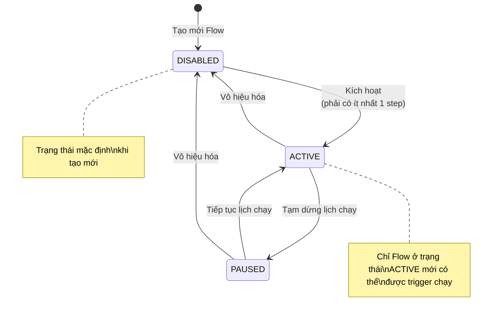

### 5.2. Flow Execution Lifecycle — Vòng đời Mỗi Lần Chạy

Trạng thái của **một lần chạy Flow** (FlowExecution):

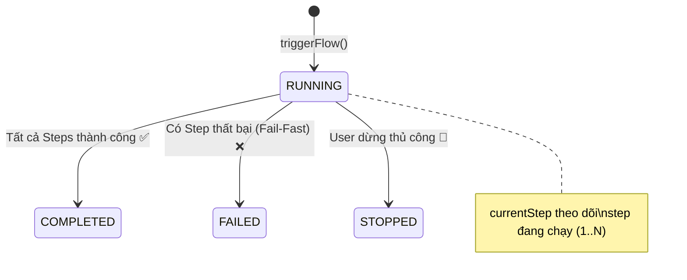

### 5.3. Step Execution Lifecycle — Vòng đời Mỗi Bước Chạy

Trạng thái của **một bước** trong lần chạy:

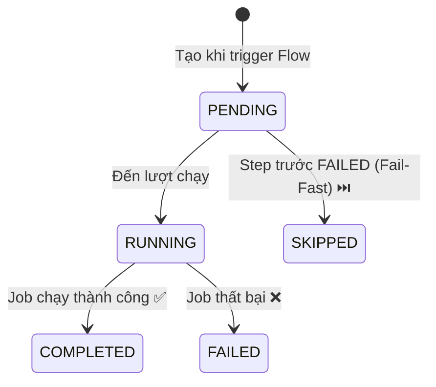

---

## 6. Entity-Relationship Diagram (ERD)

Sơ đồ dữ liệu minh họa mối quan hệ giữa các bảng chính:

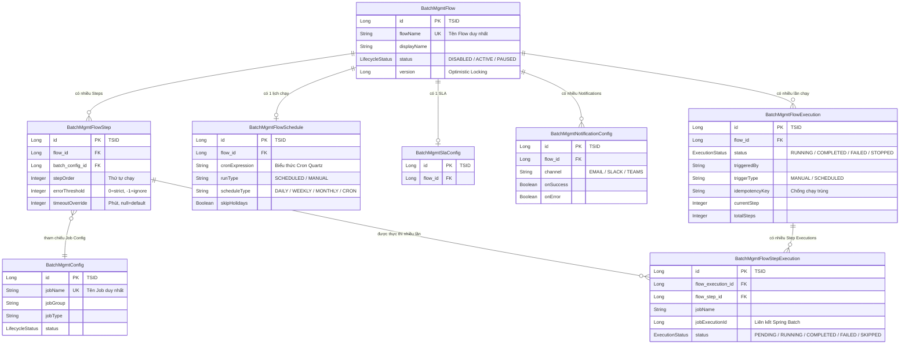

---

## 7. Các Cơ Chế Quan Trọng (Dành cho Dev)

### 7.1. Transaction Isolation — Cách ly Giao dịch

Tất cả các thao tác ghi trạng thái runtime đều sử dụng **`Propagation.REQUIRES_NEW`** trong `BatchFlowPersistenceService`. Điều này đảm bảo:

- Nếu Spring Batch job bị rollback, trạng thái Flow **KHÔNG** bị rollback theo.
- Tránh `UnexpectedRollbackException` lan truyền từ Spring Batch transaction vào Flow transaction.
- Flow state luôn được commit độc lập, đảm bảo tính nhất quán.

### 7.2. Idempotency — Chống Chạy Trùng

- Mỗi lần trigger có thể gắn một **Idempotency Key** (khóa duy nhất).
- Hệ thống kiểm tra: nếu Key đã tồn tại → từ chối trigger (No-Resume Policy).
- Đối với Quartz: dùng `context.getFireInstanceId()` làm Idempotency Key.

### 7.3. Concurrent Execution Guard — Chống Chạy Song Song

Bảo vệ 2 lớp:
1. **Quartz**: `@DisallowConcurrentExecution` ngăn Quartz fire trigger mới khi trigger cũ chưa xong.
2. **Database**: Check `existsByFlowIdAndStatus(RUNNING)` trước khi tạo FlowExecution mới.

### 7.4. Cầu nối Spring Batch ↔ Flow Engine

`FlowExecutionListener` là cầu nối giữa Spring Batch và Flow Engine:

```
Spring Batch Job chạy xong
    → FlowExecutionListener.afterJob()
        → Đọc flowExecutionId & flowStepOrder từ JobParameters
            → Nếu COMPLETED: gọi BatchFlowExecutor.onStepCompleted()
            → Nếu FAILED:    gọi BatchFlowExecutor.onStepFailed()
```

### 7.5. Post-Execution Hooks — SLA & Notification

`BatchManagementExecutionListener` (order=100, chạy sau FlowExecutionListener order=50):
1. **SLA Evaluation**: Đánh giá xem Job có vi phạm SLA không (vượt thời gian cho phép).
2. **Notification Dispatch**: Tra cứu `Config → FlowStep → Flow → NotificationConfig` rồi gửi thông báo theo kênh (Email/Slack/Teams) dựa trên trạng thái (onSuccess/onError/onWarning).

---

## 8. Tóm Tắt Cho BA

> **Batch Flow giống như một dây chuyền sản xuất tự động trong nhà máy:**

1. **Bước 1 — Chuẩn bị Vật Tư** (BatchConfigController): BA/Admin tạo các "Job" (tác vụ) riêng lẻ, ví dụ:
   - Job A: "Tính điểm thưởng khách hàng"
   - Job B: "Gửi email khuyến mãi"
   - Job C: "Xuất báo cáo tổng hợp"

2. **Bước 2 — Lắp Dây Chuyền** (BatchFlowController): Lắp ráp các Job thành một Flow có thứ tự:
   - Flow "Chiến dịch cuối tháng" = Job A (bước 1) → Job B (bước 2) → Job C (bước 3)
   - Cài đặt lịch chạy: "Mỗi ngày 30 hàng tháng lúc 2:00 sáng"
   - Cài đặt SLA: "Phải hoàn thành trong 2 giờ"
   - Cài đặt thông báo: "Gửi email cho team nếu thất bại"

3. **Bước 3 — Vận Hành**: Khi đến giờ, Quartz tự động kích hoạt Flow:
   - Chạy Job A → xong ✅ → tự động chạy Job B → xong ✅ → tự động chạy Job C → xong ✅ → **Flow COMPLETED**
   - Nếu Job B thất bại ❌ → Job C bị bỏ qua (SKIPPED) → **Flow FAILED** → Gửi thông báo lỗi

4. **Bước 4 — Giám sát**: Admin có thể dừng Flow đang chạy bất cứ lúc nào (User Stop).

---

## 9. Ví Dụ Thực Tế End-to-End (Dành cho BA)

Phần này minh họa toàn bộ quy trình bằng một ví dụ cụ thể từ nghiệp vụ thực tế.

### 9.1. Bối Cảnh: Chiến Dịch Tích Điểm Cuối Tháng

**Yêu cầu nghiệp vụ:**
> Vào **23:00 ngày cuối mỗi tháng**, hệ thống phải tự động:
> 1. Tính lại điểm tích lũy cho toàn bộ khách hàng
> 2. Phân loại khách hàng lên/xuống hạng thẻ (Bronze → Silver → Gold)
> 3. Gửi thông báo kết quả cho từng khách hàng

**Ràng buộc:**
- Bước (2) **chỉ chạy sau khi** bước (1) hoàn thành (do phụ thuộc dữ liệu)
- Bước (3) **chỉ chạy sau khi** bước (2) hoàn thành
- Nếu bất kỳ bước nào lỗi → **dừng ngay**, không chạy bước tiếp theo, gửi cảnh báo cho team

---

### 9.2. Bước 1 — Tạo Job Configs (Kho Vật Tư)

Admin gọi API **3 lần** để đăng ký 3 Job vào hệ thống:

**Job 1: Tính Điểm**
```http
POST /api/v1/batch/management/configs
{
  "jobName": "loyalty-point-calculation",
  "jobGroup": "LOYALTY",
  "jobType": "POINT_ENGINE",
  "displayName": "Tính điểm tích lũy khách hàng",
  "status": "ACTIVE"
}
```

**Job 2: Phân Loại Hạng**
```http
POST /api/v1/batch/management/configs
{
  "jobName": "loyalty-tier-classification",
  "jobGroup": "LOYALTY",
  "jobType": "TIER_ENGINE",
  "displayName": "Phân loại hạng thẻ khách hàng",
  "status": "ACTIVE"
}
```

**Job 3: Gửi Thông Báo**
```http
POST /api/v1/batch/management/configs
{
  "jobName": "loyalty-notification-dispatch",
  "jobGroup": "LOYALTY",
  "jobType": "NOTIFICATION",
  "displayName": "Gửi thông báo kết quả tích điểm",
  "status": "ACTIVE"
}
```

> [!NOTE]
> Sau bước này, 3 Job tồn tại trong **"Kho vật tư"** (Job Registry) với trạng thái `ACTIVE`. Chúng **chưa chạy** — chỉ là bản mô tả.

---

### 9.3. Bước 2 — Tạo Flow (Lắp Dây Chuyền)

Admin gọi **1 lần duy nhất** để tạo toàn bộ Flow, bao gồm Steps + Schedule + SLA + Notification trong một request:

```http
POST /api/v1/batch/management/flows
{
  "flowName": "end-of-month-loyalty-campaign",
  "displayName": "Chiến dịch tích điểm cuối tháng",

  "steps": [
    {
      "batchConfigId": "<id của loyalty-point-calculation>",
      "stepOrder": 1,
      "errorThreshold": 0,
      "timeoutOverride": 60
    },
    {
      "batchConfigId": "<id của loyalty-tier-classification>",
      "stepOrder": 2,
      "errorThreshold": 0,
      "timeoutOverride": 30
    },
    {
      "batchConfigId": "<id của loyalty-notification-dispatch>",
      "stepOrder": 3,
      "errorThreshold": 0,
      "timeoutOverride": 45
    }
  ],

  "schedule": {
    "cronExpression": "0 0 23 L * ?",
    "scheduleType": "MONTHLY",
    "runType": "SCHEDULED",
    "skipHolidays": false
  },

  "sla": {
    "maxDurationMinutes": 120
  },

  "notifications": [
    {
      "channel": "EMAIL",
      "recipients": ["team-loyalty@company.com"],
      "onSuccess": true,
      "onError": true
    },
    {
      "channel": "SLACK",
      "webhookUrl": "https://hooks.slack.com/...",
      "onError": true,
      "onSuccess": false
    }
  ]
}
```

**Response:** Flow được tạo với `status = DISABLED` (chưa kích hoạt).

> [!IMPORTANT]
> Sau bước này, **1 request duy nhất** đã tạo ra đầy đủ:
> - 1 Flow definition
> - 3 Flow Steps (có thứ tự)
> - 1 Lịch chạy Cron (`L` = ngày cuối tháng)
> - 1 SLA (tối đa 120 phút)
> - 2 kênh thông báo (Email + Slack)
>
> Tất cả nằm trong **một giao dịch nguyên tử** — hoặc tất cả thành công, hoặc không có gì được lưu.

---

### 9.4. Bước 3 — Kích Hoạt Flow

```http
PUT /api/v1/batch/management/flows/<flowId>
{
  "status": "ACTIVE"
}
```

Hệ thống kiểm tra điều kiện trước khi cho phép `ACTIVE`:
- ✅ Flow phải có ít nhất 1 Step
- ✅ Cron expression hợp lệ
- ✅ Không có Flow nào đang `RUNNING` với cùng tên

**Sau khi kích hoạt**, Quartz Scheduler tự động nhận lịch và chuẩn bị trigger.

---

### 9.5. Sơ Đồ Timeline — Kịch Bản Thành Công

Minh họa timeline từ 23:00 đến khi Flow hoàn thành:

```mermaid
gantt
    title Chiến dịch Tích Điểm Cuối Tháng — Kịch Bản Thành Công
    dateFormat HH:mm
    axisFormat %H:%M

    section Hệ thống
    Quartz kích hoạt Flow          : milestone, m1, 23:00, 0m

    section Step 1 — Tính Điểm
    loyalty-point-calculation      : active, s1, 23:00, 55m

    section Step 2 — Phân Hạng
    loyalty-tier-classification    : active, s2, 23:55, 25m

    section Step 3 — Thông Báo
    loyalty-notification-dispatch  : active, s3, 00:20, 30m

    section Kết Quả
    Flow COMPLETED ✅               : milestone, m2, 00:50, 0m
    Email gửi team                 : milestone, m3, 00:50, 0m
```

**Tóm tắt kịch bản thành công:**

| Thời điểm | Sự kiện | Trạng thái Flow |
|---|---|---|
| 23:00 | Quartz trigger → tạo FlowExecution | `RUNNING` |
| 23:00 | Step 1 bắt đầu chạy | Step 1: `RUNNING` |
| 23:55 | Step 1 hoàn thành → tự động kích hoạt Step 2 | Step 1: `COMPLETED` |
| 23:55 | Step 2 bắt đầu chạy | Step 2: `RUNNING` |
| 00:20 | Step 2 hoàn thành → tự động kích hoạt Step 3 | Step 2: `COMPLETED` |
| 00:20 | Step 3 bắt đầu chạy | Step 3: `RUNNING` |
| 00:50 | Step 3 hoàn thành → Flow kết thúc | `COMPLETED` ✅ |
| 00:50 | Gửi email thông báo thành công | — |

---

### 9.6. Sơ Đồ Timeline — Kịch Bản Fail-Fast (Step 2 Lỗi)

```mermaid
gantt
    title Chiến dịch Tích Điểm Cuối Tháng — Kịch Bản Fail-Fast
    dateFormat HH:mm
    axisFormat %H:%M

    section Step 1 — Tính Điểm
    loyalty-point-calculation (OK) : active, s1, 23:00, 55m

    section Step 2 — Phân Hạng
    loyalty-tier-classification (LỖI) : crit, s2, 23:55, 15m

    section Step 3 — Thông Báo
    SKIPPED — không chạy           : done, s3, 00:10, 5m

    section Kết Quả
    Flow FAILED ❌                  : milestone, m2, 00:10, 0m
    Slack cảnh báo team            : milestone, m3, 00:10, 0m
```

**Tóm tắt kịch bản Fail-Fast:**

| Thời điểm | Sự kiện | Trạng thái |
|---|---|---|
| 23:00 | Flow bắt đầu, Step 1 chạy | Flow: `RUNNING`, Step 1: `RUNNING` |
| 23:55 | Step 1 OK → Step 2 bắt đầu | Step 1: `COMPLETED`, Step 2: `RUNNING` |
| 00:10 | Step 2 **gặp lỗi** (DB timeout) | Step 2: `FAILED` ❌ |
| 00:10 | **Fail-Fast kích hoạt**: Step 3 bị hủy ngay lập tức | Step 3: `SKIPPED` ⏭️ |
| 00:10 | Flow kết thúc sớm | Flow: `FAILED` ❌ |
| 00:10 | Slack gửi cảnh báo lỗi cho team | — |

> [!WARNING]
> **Điểm quan trọng cho BA:** Hệ thống **KHÔNG tự retry** (chạy lại). Sau khi Flow `FAILED`, team kỹ thuật cần kiểm tra nguyên nhân, sửa lỗi, rồi trigger lại thủ công qua màn hình quản trị.

---

### 9.7. Sơ Đồ Tổng Quan Nghiệp Vụ (Dành Riêng Cho BA)

Sơ đồ dưới đây tóm tắt **toàn bộ vòng đời** từ góc nhìn nghiệp vụ, không đi vào chi tiết kỹ thuật:

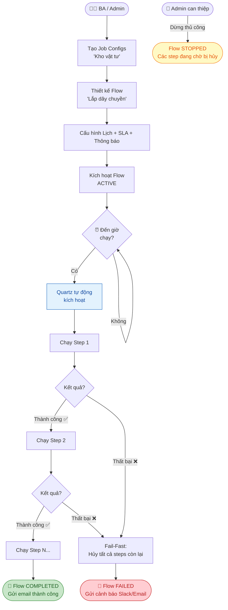

---

### 9.8. Bảng So Sánh: Job Config vs Flow (Giải Thích Nhanh Cho BA)

| Tiêu chí | Job Config (`/configs`) | Flow (`/flows`) |
|---|---|---|
| **Là gì?** | Bản mô tả một tác vụ đơn lẻ | Quy trình gồm nhiều tác vụ có thứ tự |
| **Ví von** | Công thức nấu ăn từng món | Thực đơn bữa tiệc đầy đủ |
| **Tự chạy không?** | ❌ Không — chỉ là định nghĩa | ✅ Có — theo lịch hoặc thủ công |
| **Có lịch chạy không?** | ❌ Không | ✅ Có (Cron / Manual) |
| **Có SLA không?** | ❌ Không | ✅ Có |
| **Có thông báo không?** | ❌ Không | ✅ Có (Email / Slack / Teams) |
| **Tương tác chính** | Tạo / Sửa / Bật-Tắt | Tạo / Cập nhật / Kích hoạt / Dừng / Xem lịch sử |

---

### 9.9. Câu Hỏi Thường Gặp Từ BA

**Q: Nếu muốn thêm bước mới vào Flow đang ACTIVE, có cần dừng Flow không?**
> A: Không cần dừng. Gọi `PUT /flows/{id}` với danh sách steps mới — hệ thống sẽ áp dụng **Smart Merge** (cập nhật thông minh): thêm step mới, cập nhật step hiện có, xóa step không còn trong danh sách. Thay đổi có hiệu lực ở **lần chạy tiếp theo**.

**Q: Một Flow có thể dùng cùng một Job nhiều lần không?**
> A: Có. Ví dụ: Step 1 = Job "Gửi thông báo" (cho nhóm A), Step 3 = Job "Gửi thông báo" (cho nhóm B). Mỗi Step là một lần thực thi độc lập.

**Q: Nếu muốn chạy thử (không theo lịch), có thể không?**
> A: Có. Gọi `POST /flows/{id}/trigger` với `runType = MANUAL` để kích hoạt ngay lập tức.

**Q: Làm sao biết Flow đang chạy có lỗi gì?**
> A: Xem `GET /flows/{id}` → trường `latestExecution` → `steps[].errorMessage` để đọc thông báo lỗi cụ thể của từng bước.

**Q: Flow FAILED có thể tự động chạy lại không?**
> A: **Không.** Đây là thiết kế có chủ đích (Fail-Fast — No Auto-Retry). Team kỹ thuật sẽ nhận thông báo, điều tra, và trigger lại thủ công sau khi xử lý nguyên nhân.
